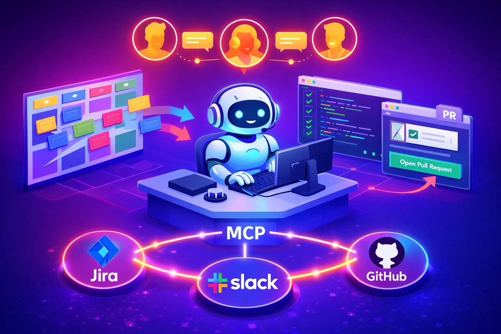

# delivering-tickets

<p align="center">
  
</p>

An AI agent skill that picks tasks from your board, implements them, opens a PR, and notifies the team. Connects to your tools via [MCP](https://modelcontextprotocol.io).

## Install

```bash
npx skills add github.com/cesconix/skills --skill delivering-tickets
```

Requires an AI coding agent with skills + MCP support, [Superpowers](https://github.com/obra/superpowers), and MCP servers for your tools (board, chat, code hosting).

## Getting started

**1. Configure MCP servers** for the tools your project uses. Only install what you need — for example, if your team uses Jira + GitHub + Slack, configure those three. The project file declares which MCP tools are required, and `/delivering-tickets:setup` will tell you if anything is missing.

**2. Create your local config** at `~/.config/delivering-tickets/config.yml` — this maps repo names to local paths and tells the agent where to find project files:

```yaml
projects: ~/.config/delivering-tickets/projects
repositories:
  my-app: ~/workspace/my-app
  my-api: ~/workspace/my-api
```

**3. Create a project** — run `/delivering-tickets:project` and the agent walks you through it: repos, board, contacts, conventions, testing, tribal knowledge. Or create the project file manually (see [Project configuration](#project-configuration)).

**4. Verify** with `/delivering-tickets:setup` — checks MCP tools, repos, plugins, and shows what's missing.

**5. Go** — `/delivering-tickets` → "Work on MYAPP-42" or "Pick the next task".

## How it works

Ticket in → PR out. The agent:

1. **Fetches the task** from your board via MCP
2. **Assesses complexity** and decides how much autonomy to use
3. **Explores** the codebase, docs, and tribal knowledge
4. **Asks people** when something is unclear — matches doubts to the right contact
5. **Implements** with Superpowers skills (planning, TDD, debugging, code review)
6. **Verifies** — tests, lint, typecheck, integration tests if enabled
7. **Quality gate** — 10-point checklist before delivery
8. **Delivers** — PR, board update, ticket comment, team notification
9. **Learns** — proposes updates to tribal knowledge and conventions

### Autonomy

Not fully autonomous, by choice:

| Task | Knowledge | Behavior |
|------|-----------|----------|
| Simple | Any | Goes ahead |
| Medium | High | Goes ahead, notifies |
| Medium | Low | Pauses, shares plan first |
| Complex | High | Pauses, asks for review before PR |
| Complex | Low | Stops, asks questions before planning |

Override anytime: "go fully autonomous" or "check with me at each step".

### Communication

The agent proactively contacts people when it has doubts. It matches the question to the right person using `contacts` and their `ask_about` topics, adapts tone to their role (technical vs non-technical), and waits for a reply — no polling, no guessing.

### Quality gate

Every delivery passes a 10-point checklist: acceptance criteria, tests, lint/typecheck, no unrelated changes, no secrets, commit conventions, branch naming, docs, PR description, integration tests. Each item must be ✅ or explicitly skipped with user approval.

### Continuous learning

After each ticket, the agent proposes what it learned — tribal knowledge, coding conventions, new doc sources, contact updates. Nothing is written without approval.

## Commands

| Command | What it does |
|---------|-------------|
| `/delivering-tickets` | Start working on a ticket |
| `/delivering-tickets:check` | Check for replies on pending questions |
| `/delivering-tickets:status` | Show workflow status (task, step, blockers) |
| `/delivering-tickets:setup` | Verify environment readiness |
| `/delivering-tickets:project` | Create or edit a project |

## Project configuration

Each project is a YAML file in `~/.config/delivering-tickets/projects/`. Can live in a shared Git repo for team-wide consistency.

```yaml
project: "my-project"

repositories:
  - name: my-app
    repo: git@github.com:company/my-app.git
    base_branch: main

board:
  tool: jira                          # jira | clickup | github
  project_key: "MYAPP"
  statuses:
    todo: "To Do"
    in_progress: "In Progress"
    in_review: "In Review"
    done: "Done"

contacts:
  - name: "Alice Rossi"
    role: tech_lead                   # tech_lead | developer | devops | pm_technical | pm_business | stakeholder | product_owner
    channel: slack                    # slack | teams | prompt
    handle: "@alice.rossi"
    ask_about:
      - architecture
      - code patterns

  - name: "Marco Bianchi"
    role: pm_business
    channel: slack
    handle: "@marco.bianchi"
    ask_about:
      - requirements clarification
      - priority and scope

notifications:
  tool: slack                         # slack | teams
  channel: "#my-app-dev"

documentation:
  sources:
    - ./docs/
    - ./README.md
    - https://confluence.company.com/wiki/my-project

conventions:
  branching: "feat/{ticket-id}-{short-desc}"
  commit_style: conventional          # conventional | freeform
  pr_reviewers:
    - alice.rossi

testing:
  commands:
    - npm test
    - npm run lint
    - npm run typecheck
  integration:
    enabled: true

tribal_knowledge:
  - "Never modify the legacy auth module directly — use the adapter in src/adapters/auth.ts"
  - "The payment service has a 30s timeout in staging — mock it in tests"

mcp_tools:
  board: jira
  notifications: slack
  code: github
  docs: confluence

setup:
  required_plugins:
    - name: superpowers
      install: "/plugin install superpowers@claude-plugins-official"
  required_mcp:
    - name: jira
      purpose: "Board management"
    - name: slack
      purpose: "Notifications and async communication"
    - name: github
      purpose: "PR creation and code review"
```

## Troubleshooting

| Problem | Solution |
|---------|----------|
| Project not found | `/delivering-tickets:project` to create one |
| Local config missing | Create `~/.config/delivering-tickets/config.yml` |
| Repo not cloned | Clone from project file URL, or `/delivering-tickets:setup` |
| MCP not responding | Check agent settings and API key/token |
| Skill doesn't trigger | Use `/delivering-tickets` explicitly |
| Agent skips steps | Say "check with me at each step" |
| Integration tests fail | Start services from the worktree path, not the main repo |

## License

MIT
